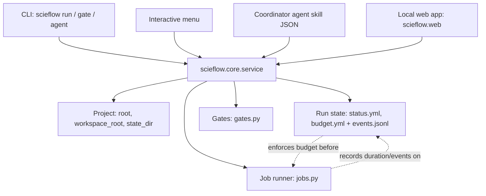

# Architecture

This page is for extending ScieFlow's core, or building against
`scieflow.web`, the local web app. For the concepts a run, its event log,
jobs and gates represent, read [Runs, jobs and gates](runs.md) first — this
page is about how the pieces are built and fit together, not what they
mean.

## Layering

Every caller — the CLI, the interactive menu, the coordinator agent's skill
JSON, and the local web app (`scieflow serve`, see [The local web
app](web.md)) — goes through one service layer, `scieflow.core.service`.
Nothing below that layer knows or cares who called it. `scieflow.web`'s
routes (`app.py`, `pages.py`, `api.py`, `sse.py`) are thin callers exactly
like the CLI's commands: they translate HTTP into a service call and back
and hold no logic of their own.



`service.py` functions return plain, JSON-ready data (dicts built with
`dataclasses.asdict`) and raise `ServiceError` for anything a caller should
show the user rather than crash on. `list_runs`, `run_detail`, `run_events`,
`dispatch_agent`, `cancel_job`, `open_gates`, `answer_gate` and
`agent_settings` are the current surface — see
`src/scieflow/core/service.py`.

## Project context

`scieflow.core.project.Project` (`src/scieflow/core/project.py`) replaces
reading the current working directory. The CLI builds one with
`Project.discover()` (walks up from the current directory to find the repo);
tests and library callers build one directly with `Project(root)`:

| Property / method | Gives you |
|---|---|
| `root` | the repo root |
| `workspace_root` | `root / "workspace"` |
| `state_dir` | project-level runtime state for jobs outside any run — `root / ".scieflow"`, or `SCIEFLOW_STATE_DIR` if set |
| `run_dir(slug)` | `workspace/<slug>`, after checking `slug` is a safe name (`Project.run_dir` rejects `..` and anything not matching a plain slug) |
| `agents()` / `defaults()` | parsed `config/agents.yml` / `config/defaults.yml` |
| `schema(name)` | a parsed file from `schemas/<name>.yml` |

A `Project` is immutable and cheap to construct. `scieflow serve` builds one
with `Project.discover()` at startup and `create_app` stores that single
instance on `app.state.project`; every request reads the same instance
(`request.app.state.project`) rather than depending on a process-wide
current directory, which is safe precisely because the object is immutable.

## Where state lives on disk

Everything about one run lives under `workspace/<slug>/`:

| Path | Holds | Written by |
|---|---|---|
| `status.yml` | the run's ULID `id`, iteration, each phase's state, `stopped` block | `scieflow.core.run.status` / `actions` |
| `budget.yml` | budget caps and spend so far | `scieflow.core.run.budget` / `actions` |
| `config.yml` | this run's `assignments:`, `agent_overrides:`, `support_as_primary:` — differences from `config/defaults.yml` | `scieflow.core.agent_configure` |
| `events.jsonl` | the append-only history of the run | `scieflow.core.events` |
| `jobs/<id>.json`, `<id>.log`, `<id>.err` | one record + streamed output per job started inside this run | `scieflow.core.jobs` |
| `gates/<id>.json` | one file per approval the run opened | `scieflow.core.gates` |

Work that is not inside any run — a dispatch run directly from the CLI
outside a workspace, for instance — records its job under
`Project.state_dir / "jobs"` instead. `jobs.list_jobs()` looks in both places
(the given run's `jobs/`, or `state_dir/jobs` plus every
`workspace/*/jobs` when no run is given), so `scieflow run list` and a
project-wide job view see everything.

## The service rule: every action exists once

The reason the CLI, the menu, agent skills and the web app agree on what a
run looks like is structural, not a convention someone has to remember:
**an action is written once, as a function in `scieflow.core.service`, and
every caller is a thin wrapper around it.**

Concretely, `scieflow/core/run/cli.py`'s `list` command is:

```python
def list_cmd(as_json):
    runs = service.list_runs(Project.discover())
    ...
```

and `scieflow.web.api`'s HTTP handler for the same thing is:

```python
@router.get("/runs")
async def list_runs(request: Request) -> list[dict]:
    return service.list_runs(_project(request))
```

Both parse only their own transport (Click options and stdout for one,
query params and JSON for the other) and never re-implement what a run
listing means. When you add a new capability, decide first whether it is a
new service function or a variation of an existing one; only after that
write the CLI command (or HTTP route) that calls it.

Some actions bypass `service.py` and call the lower `run.actions` /
`gates` / `jobs` modules directly from the CLI (for example `run mark`,
`gate open`) because no other caller needs them yet. As soon as a second
caller (the web app) needs one of those, lift it into `service.py` rather
than duplicating its logic there.

## Concurrency and safety

Multiple processes — a terminal, an agent dispatch, and a browser tab open
on `scieflow serve` — can touch the same run at once. Three primitives make
that safe:

- **File locks + atomic replace** (`scieflow.core.store`). Every YAML write
  goes through `store.write_yaml` / `store.update_yaml`, which take a
  sibling `<file>.lock` (via `filelock.FileLock`, 30s timeout) and write to a
  temp file in the same directory before `os.replace`-ing it into place —
  so a reader never sees a half-written file, and two writers never
  interleave. `store.append_jsonl` takes the same lock for events. Reads
  (`read_yaml`, `read_jsonl`) do not lock; they read whatever is currently
  on disk, which is always a complete write.
- **ULIDs** (`store.new_id`). Run ids, event ids, gate ids and job ids are
  all 26-character Crockford-base32 ULIDs: a 48-bit millisecond timestamp
  followed by 80 random bits. They sort lexically by creation time, so an
  event or job list ordered by id is already ordered by time, with no
  separate sequence counter to keep consistent under concurrent writers.
- **Actors** (`human | agent | system`). Every event and every gate answer
  carries who did it. `events.ACTORS` and `gates.answer`'s `actor` parameter
  enforce the three values, so an answer the coordinator gave itself
  (`actor="agent"`, with a rationale) can never be recorded indistinguishably
  from one you gave yourself, and a value the runner recorded on its own
  (a timeout, a `job.lost` reconciliation) is `system`, not `agent`.

Jobs add one more safety property: `jobs.start` launches the subprocess with
`start_new_session=True`, so it owns its own process group; `jobs.cancel`
and a timeout both kill that whole group (`os.killpg`, SIGTERM then SIGKILL
after a grace period), not just the immediate child — a dispatch that itself
shells out cannot outlive being cancelled.

## Extending the core

**A new job kind.** Jobs are not typed beyond a free-text `kind` (`"agent"`
today; a sync or a sweep could pass its own). Call `jobs.start(project,
argv, kind="...", cwd=..., run_dir=..., label=..., timeout_s=...)` and get
back a `Job`; `jobs.wait`, `jobs.cancel` and `jobs.reconcile` work on any
kind unchanged, and every state transition already emits the matching
`job.*` event when the job runs inside a run (`run_dir` is not `None`). You
do not need to touch `jobs.py` itself unless the new kind needs different
completion handling — see how `service.dispatch_agent` wraps `jobs.start`
today for the pattern (guard the budget, start the job, on completion record
spend and write the transcript).

**A new gate kind.** Add an entry under `kinds:` in `schemas/gates.yml` with
`requires_human` and a `help` string — nothing else needs a code change.
`gates.open_gate` validates the kind against that file, and
`gates._check_agent_may_answer` already reads `requires_human` from it, so a
new kind that needs a human blocks correctly with no further wiring. Decide
`requires_human` conservatively: it is the one field that decides whether an
autonomous run can clear the gate itself.

**A new service function.** Add it to `scieflow.core.service`, following the
existing shape: take a `Project` first, resolve any `slug` through
`project.run_dir` (or the module-local `_ws` helper) and turn a bad slug into
`ServiceError` rather than a raw exception, and return `dict`/`list[dict]`
built from dataclasses via `asdict`. Then add the thin CLI command (and,
later, the HTTP route) that calls it — the function should not need to
change when a second caller arrives.

## See also

- [Runs, jobs and gates](runs.md) — the concepts these mechanics implement.
- [CLI reference](cli.md) — every command that calls into this layer today.
- [The local web app](web.md) — the other caller, and its security model.
- [Agent configuration](agents.md) — how role assignments and per-role
  model/effort overrides are resolved (`scieflow.core.agent_config`).
