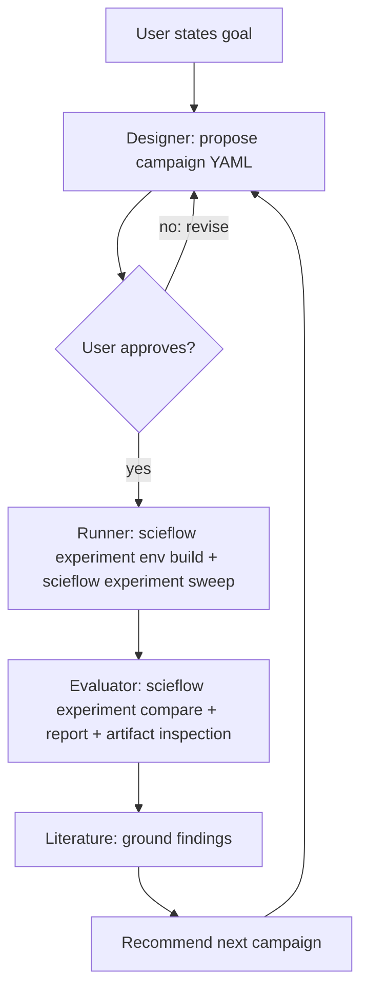

# Agent Workflow

Any agent CLI that reads `AGENTS.md` (codex, gemini, agy) or `CLAUDE.md`
(Claude Code) picks up the same contract.

## The loop

## The autonomy contract

- **Before approval:** the agent may read anything and write campaign YAML
  drafts, but must not execute runs.
- **One approval per campaign.** After you approve, the agent runs the whole
  campaign — every grid point, evaluation, and the report — without asking
  again.
- **A follow-up campaign is a new approval.** Recommendations at the end of
  a report do not authorize execution.

## Division of labor

| Concern | Owner |
|---|---|
| Grid/scenario choice, hypothesis | Agent (designer skill) + your approval |
| Execution, run recording, env snapshots | `scieflow experiment` (deterministic) |
| Metric computation, ranking, validation | `scieflow experiment` (deterministic) |
| Interpretation, sanity checks, next steps | Agent (evaluator skill) |
| Literature grounding | Agent (literature skill) |

## Sandboxing note

`scieflow experiment` does not manage agent permissions. Use your agent CLI's own
sandboxing/approval mechanism; the only host resources campaigns touch are
the repo directory and the Apptainer runtime.
