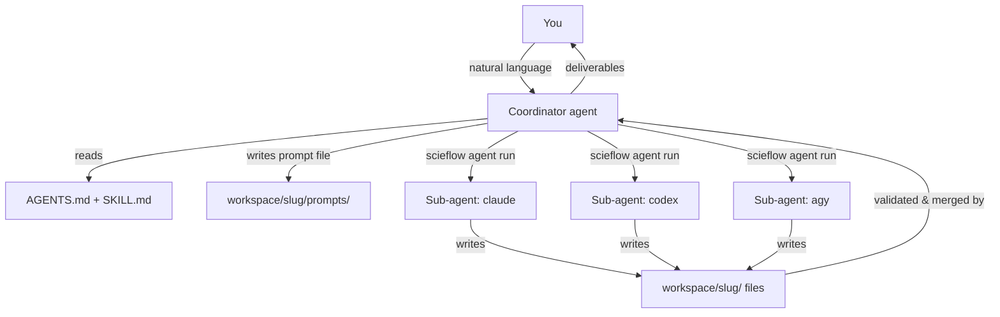

# Architecture

The research module has no orchestrator process. The intelligence lives in instruction
files that any agent reads; coordination happens through files on disk; and
the deterministic work (search, validation, export) is plain Python.

## Components

```text
ScieFlow/
├── AGENTS.md                              # root contract; links each module's AGENTS.md
├── config/
│   ├── agents.yml                         # single agent registry (models, tiers, menus)
│   ├── defaults.yml                       # `research:` workflow defaults
│   └── journals/                          # cached journal profiles (<slug>.md)
├── src/scieflow/
│   ├── core/                              # agent_run, stub_agent, config loader
│   └── research/
│       ├── AGENTS.md                      # research coordination protocol
│       ├── skills/                        # lit-review, paper-review, gap-discovery, paper-draft
│       ├── search/                        # openalex, arxiv, europepmc, crossref → normalized paper JSON
│       ├── lib/                           # shared http + paper-record helpers
│       ├── validate.py                    # `scieflow research validate`
│       ├── citations.py                   # `scieflow research check-citations`
│       ├── zotero.py                      # `scieflow research zotero-export`
│       ├── schemas/                       # findings, review, gaps, manifest, manuscript-review
│       └── templates/                     # brief, report, debate protocol, LaTeX skeleton
├── setup/                                 # install.sh, doctor.sh
└── workspace/                             # one dir per run (gitignored, DVC-synced)
```

## Coordination model



- **Coordinator** = whichever agent you talk to. It owns the run.
- **Sub-agents** are invoked headless via `scieflow agent run`, do exactly
  one prompted task, write one output file, and exit. They never dispatch other
  agents.
- **All communication is files.** No sockets, no shared memory, no message
  bus. This makes every step inspectable and every run resumable.

## Key design decisions

**Same sources, independent judgment.** All agents call the same
`scieflow research search <source>` commands, which return a single normalized paper record
(`doi, title, year, venue, cited_by, abstract, url, source`). Differences
between agents' selections therefore reflect judgment, not retrieval luck.

**Schema-gated outputs.** `findings`, `review`, `gaps`, and `manifest`
schemas define the contracts. `scieflow research validate` enforces them (JSON,
plus YAML for manifests); invalid output gets one retry with the errors fed
back, then the run degrades (quorum rules skip cross-review and debate below
two agents).

**Prompt-as-single-argv-token.** `scieflow agent run` splits the command template
with `shlex`, then substitutes `{model}`/`{prompt}` *inside* tokens — so
multi-line prompts and model names with spaces never break shell quoting.
Oversized prompts fall back to stdin delivery.

**Untrusted content is data.** Abstracts from scholarly APIs and text from
journal pages are pasted into agent prompts. research `AGENTS.md` rule 7 instructs every
agent to treat pasted/fetched content as data, never instructions, and to
report embedded directives rather than follow them — a guardrail against
prompt injection, since agents run with elevated permissions.

**Zero-token testability.** The `stub` agent emits canned schema-valid output,
so the e2e tests exercise the entire lit-review, gap-discovery, and
paper-draft flows — fan-out, validation, debate rounds, assembly, export —
offline. The full suite (65 tests) never touches the network or a real agent
CLI (the LaTeX compile check runs only where `latexmk` exists).

## Shared mechanisms

Two building blocks are shared across workflows rather than owned by one:

**Data packages** (`workspace/<slug>/inputs/` + `manifest.yml`). Your own
processed results become citable evidence with stable ids
(`[data:<id>]`). AGENTS.md rule 8 binds every agent: no quantitative claim
without a traceable source — a searched DOI, a manifest artifact, or a
delivered-article location. See [Data Packages](data-packages.md).

**Perspective debate** (`src/scieflow/research/templates/debate-protocol.md` +
`src/scieflow/research/templates/perspective-prompt.md`). A bounded propose → discuss →
adjudicate loop in which agents challenge framings and findings. Validity
claims are adjudicated with evidence, never auto-accepted; unresolved
disagreement ships as recorded dissent. Used by gap-discovery (full debate)
and paper-draft (one-round outline critique). See
[Perspective Debate](debate.md).

## Reliability & degraded modes

| Situation | Behavior |
| --- | --- |
| An agent times out | Logged in `log.md`; phase continues with the rest. |
| Invalid JSON output | One retry with error feedback; second failure → agent marked `failed`, run continues. |
| Only one agent produces findings | Cross-review skipped; report marked *single-agent, unreviewed*. |
| Prompt too large for argv | Delivered via stdin (per-agent `stdin_cmd` if defined). |
| A paper has no DOI | Listed under a `# no-doi` comment in `selected_dois.txt`; skipped by Zotero export, still in the report. |
| Run interrupted | `status.yml` records phase completion; resume continues from the first unfinished phase. |

## Testing

- **Unit** — each script tested with mocked HTTP (`responses`) and unit calls;
  no live network.
- **Integration** — `scieflow agent run` exit-code/timeout/stdin contracts; Zotero
  export against a fake `zot` on `PATH`.
- **End-to-end** — `test_e2e_stub.py` runs the whole pipeline with three stub
  agents and asserts the full artifact tree plus schema validity.
- **Live** — `setup/doctor.sh --agents` is the on-machine check that real CLIs
  respond headless (not part of the offline suite).
