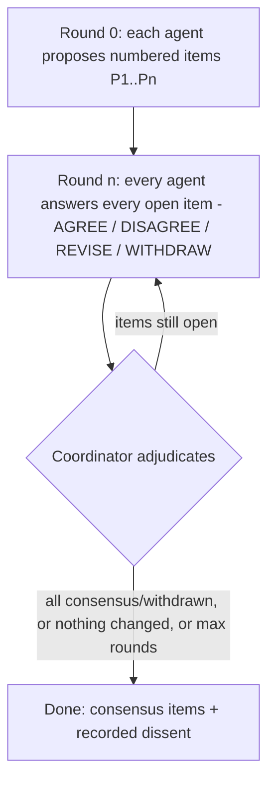

# Perspective Debate

Both new workflows can run a structured multi-agent debate: agents
(claude, codex, agy) each propose alternative viewpoints, then discuss
each other's proposals for a bounded number of rounds while the
coordinator adjudicates. It implements the "another point of view"
capability: challenge the framing, reinterpret the results, propose
alternative directions.

Protocol source of truth: `src/scieflow/research/templates/debate-protocol.md` (mechanics) and
`src/scieflow/research/templates/perspective-prompt.md` (the contrarian role).

## How a debate runs

Every item needs evidence (a DOI, a `[data:<id>]` artifact ref, or an
article location) — no evidence, no item.

## The challenge rule

A claim of "this is invalid" from one agent is **never trusted
immediately**:

1. The item becomes `challenged`, not deleted.
2. It is dropped only if the author concedes, or the coordinator verifies
   the challenge against evidence (re-running a search script, opening the
   manifest artifact).
3. Anything still contested at the end ships in the report as **recorded
   dissent** — both positions, side by side. The report never silently
   picks a winner.

## Tuning

- `max_debate_rounds` (default 2) in `config/agents.yml` or per-workspace
  `config.yml`. Round 0 (propose) is not counted.
- More rounds rarely help: if two agents still disagree after two
  discussion rounds, that disagreement is signal — read the dissent
  section instead of buying more rounds.
- Debates need ≥ 2 participating agents; below quorum the phase is skipped
  and the report is marked "single-agent, undebated".
