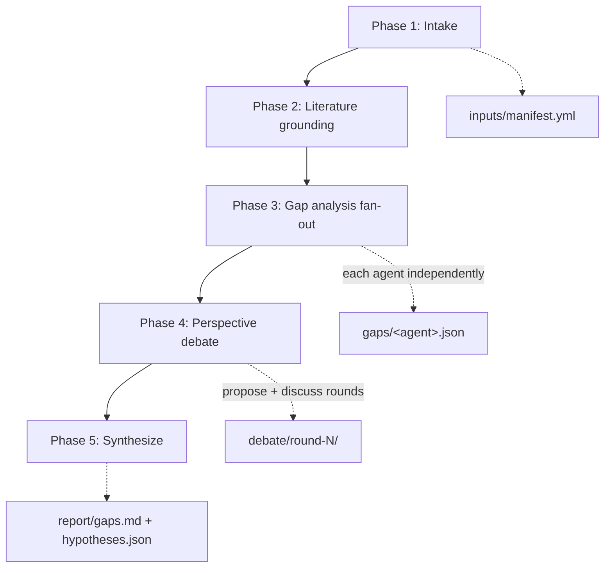

# Gap Discovery Workflow

**Protocol file:** `src/scieflow/research/skills/gap-discovery/SKILL.md` (the coordinator reads this).

A five-phase pipeline that answers *"what does the field not know yet — and
what could I discover with what I have?"*. Agents ground their analysis in
three evidence sources: a literature search, your draft article (optional),
and your [data package](../data-packages.md) (optional). The result is a gap
report with ranked, testable hypotheses, each carrying an experiment design
and a full evidence trail.

## Phase overview



| Phase | Who | Output |
| --- | --- | --- |
| 1. Intake | Coordinator (+ you) | `inputs/` data package, `brief.md`, `status.yml` |
| 2. Literature | All agents (fan-out) | `findings/<agent>.json` — or reused from a lit-review run |
| 3. Gap analysis | All agents (fan-out) | `gaps/<agent>.json` (schema-validated) |
| 4. Debate | All agents + coordinator | `debate/round-N/<agent>.md`, adjudications |
| 5. Synthesize | Coordinator only | `report/gaps.md`, `report/hypotheses.json`, `report/selected_dois.txt` |

## Phase 1 — Intake

The coordinator builds your data package: your result files go to
`inputs/results/`, your processing description to `inputs/processing.md`,
optional scripts and draft article alongside. It interviews you about
anything it can't infer — what each artifact is and how it was produced —
and writes the validated `inputs/manifest.yml` that gives each artifact a
citable id like `[data:tbl-metrics]`. No data? The run proceeds on
literature + article alone and says so in the report.

## Phase 2 — Literature grounding

The same search fan-out as the [literature review](lit-review.md) (same
shared search scripts, same schema validation) but without cross-review —
this is grounding, not a full review. If you already ran a lit-review on
the topic, set `literature_from:` in the workspace `config.yml` and this
phase reuses those findings instead of searching again.

## Phase 3 — Gap analysis

Each agent independently maps what the literature answers against what your
brief asks, cross-checks both against what your delivered results actually
show, and writes up to `max_gaps` gaps and `max_hypotheses` hypotheses —
every one with an evidence trail (DOIs, `[data:<id>]` refs, article
locations) and each hypothesis with a testable prediction, confidence
score, and an experiment design block. Outputs are schema-validated with
one retry, like every fan-out in the ScieFlow research module.

## Phase 4 — Perspective debate

Agents challenge each other: alternative framings of the problem,
reinterpretations of your data, attacks and defenses of the proposed gaps
and hypotheses — following the [perspective debate](../debate.md) protocol.
A "this is invalid" claim never silently kills an item; unresolved
disagreements ship as recorded dissent.

## Phase 5 — Synthesize

The coordinator deduplicates gaps, ranks hypotheses (debate status first,
mean confidence second), and writes `report/gaps.md` with problem framings,
gaps, ranked hypotheses with experiment designs, and recorded dissent —
plus `report/hypotheses.json` and `report/selected_dois.txt` for chaining
into [paper-draft](paper-draft.md) and Zotero export.

## How to run it properly

- **Use all three agents.** Gap finding lives off independent viewpoints;
  two is the bare minimum for debate quorum, three is meaningfully better.
- **Reuse a lit-review** via `literature_from:` when you have one — cheaper,
  and peer-reviewed selections beat freshly-searched ones.
- **Deliver processed summary artifacts**, not raw dumps — see
  [data packages](../data-packages.md). Agents quote your files; they don't
  recompute them.
- **Read `## Recorded dissent` first.** The items the agents couldn't agree
  on are usually the most interesting ones.
- **Chain forward:** a good gap report is the ideal input for
  [paper-draft](paper-draft.md) via `gaps_from:`.

## Example

You have processed results in `~/study/out/` and want to know what's novel:

> "Find research gaps for <topic>. My results are in ~/study/out/:
> metrics.csv is per-model accuracy, produced by analyze.py which I'm
> including. Use all agents."

The coordinator builds the package and confirms the manifest with you:

```yaml
artifacts:
  - id: tbl-metrics
    file: results/metrics.csv
    kind: table
    description: per-model accuracy, 5-fold CV
    produced_by: scripts/analyze.py
```

then searches, fans out gap analysis, debates, and reports:

```text
workspace/2026-07-<topic>/report/gaps.md          ← read this
workspace/2026-07-<topic>/report/hypotheses.json  ← feeds paper-draft
workspace/2026-07-<topic>/report/selected_dois.txt
```

Follow-ups: "export the cited papers to Zotero" or "draft a paper from
hypothesis H2" (starts paper-draft with `gaps_from:` set).
