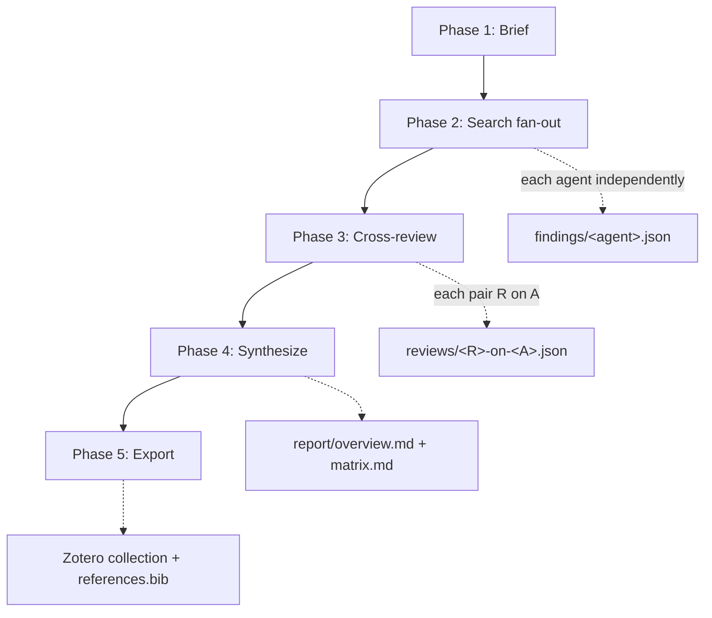

# Literature Review Workflow

**Protocol file:** `src/scieflow/research/skills/lit-review/SKILL.md` (the coordinator reads this).

A five-phase pipeline that turns a topic request into a peer-reviewed,
ranked literature overview with reference export. Each phase is resumable via
`workspace/<slug>/status.yml`.

## Phase overview



| Phase | Who | Output |
| --- | --- | --- |
| 1. Brief | Coordinator | `brief.md`, `config.yml`, `status.yml` |
| 2. Search | All agents (fan-out) | `findings/<agent>.json` (schema-validated) |
| 3. Cross-review | All agents (each reviews the others) | `reviews/<R>-on-<A>.json` |
| 4. Synthesize | Coordinator only | `report/overview.md`, `report/matrix.md`, `report/selected_dois.txt` |
| 5. Export | Coordinator | Zotero collection + `report/references.bib` |

## Phase 1 — Brief

The coordinator fills `src/scieflow/research/templates/brief.md`: research questions, inclusion /
exclusion criteria, timeframe, and `max_papers`. It only asks you a question
if the topic itself is ambiguous; otherwise it picks sensible scope and notes
it. Any constraints you gave (specific agents, Zotero target) go into the
workspace `config.yml`.

## Phase 2 — Search (fan-out)

Every enabled agent — except the coordinator, which does its own search too —
gets a prompt telling it to:

1. Derive 3–6 queries from the brief.
2. Run each through **at least two** shared search scripts (OpenAlex, arXiv,
   Europe PMC, Crossref), respecting the timeframe.
3. Deduplicate, select the best papers up to the brief's max, and score each
   1–5 with a one-sentence justification.
4. Write `findings/<agent>.json` and validate it.

!!! warning "No invented papers"
    Every paper an agent reports must come from a search-script result — no
    recalling citations from memory, no fabricated DOIs. This is a hard rule
    in `AGENTS.md`, and cross-review explicitly checks for it.

Validation failures get **one retry** with the errors fed back. A second
failure marks that agent `failed` in `status.yml` and the run continues with
the rest.

## Phase 3 — Cross-review

For each ordered pair (reviewer **R**, author **A**), R reads A's findings and
writes `reviews/R-on-A.json`: per-paper score + verdict
(`strong`/`ok`/`weak`/`duplicate`/`off-topic`) + comment, plus a `missing`
list of important papers A didn't include, plus a summary.

If fewer than two agents produced valid findings, cross-review is **skipped**
(`skipped-quorum`) and the final report is labeled *single-agent, unreviewed*.

## Phase 4 — Synthesize

Coordinator-only, no dispatch. It:

- Deduplicates papers by DOI (fallback: normalized title).
- Ranks: papers proposed by multiple agents and scored ≥4 by reviewers are
  **consensus**; papers whose reviewer scores diverge by ≥2 are **disputed**.
- Writes `report/overview.md` (exec summary, consensus ranked first, disputed
  papers with dissent notes, gaps from the union of `missing` flags).
- Writes `report/matrix.md` (paper × method / data / limitation table).
- Writes `report/selected_dois.txt` (DOIs to export; papers without a DOI are
  listed under a trailing `# no-doi` comment and skipped by export).

## Phase 5 — Export

```bash
uv run scieflow research zotero-export --workspace workspace/<slug>
```

Ensures the target collection exists, adds each selected DOI to the configured
Zotero library (personal or a specific group — see
[Configuration](../configuration.md)), moves the items into the collection,
and writes `report/references.bib`. The coordinator then reports the report
location, collection name, library used, and any failed/skipped agents.

## Workspace layout

```text
workspace/2026-07-<topic-slug>/
├── brief.md
├── config.yml            # optional per-run overrides
├── status.yml            # phase completion, per-agent success/failure
├── prompts/              # generated sub-agent prompts (audit trail)
├── logs/                 # sub-agent transcripts
├── findings/{claude,codex,agy}.json
├── reviews/<agent>-on-<other>.json
├── report/{overview.md, matrix.md, selected_dois.txt, references.bib}
└── log.md                # run log: timings, failures, retries
```
