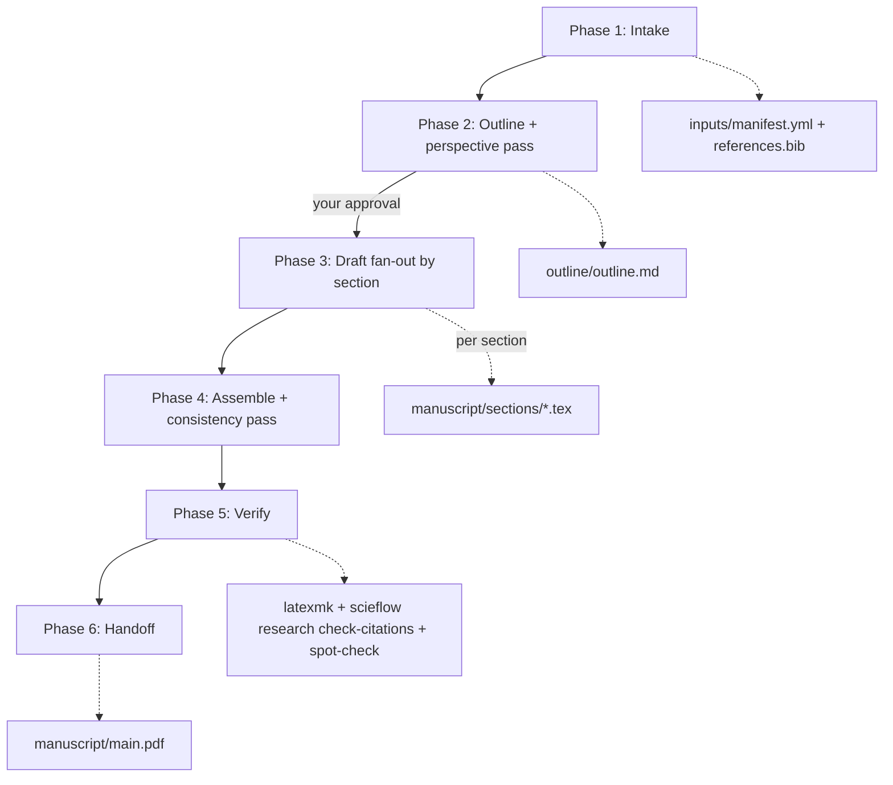

# Paper Draft Workflow

**Protocol file:** `src/scieflow/research/skills/paper-draft/SKILL.md` (the coordinator reads this).

A six-phase pipeline that turns your [data package](../data-packages.md)
into a compilable LaTeX article draft. Your processing description becomes
the Methods "Data processing" subsection; every number in Results carries a
`% source: [data:<id>]` provenance comment; and the draft is verified three
ways (compile, citation integrity, provenance spot-check) before landing
exactly where the [paper review](paper-review.md) loop picks it up.

## Phase overview



| Phase | Who | Output |
| --- | --- | --- |
| 1. Intake | Coordinator (+ you) | `inputs/` data package, `manuscript/references.bib` |
| 2. Outline | One agent + perspective pass | `outline/outline.md` — **shown to you for approval** |
| 3. Draft | All agents (fan-out by section) | `manuscript/sections/<section>.tex` |
| 4. Assemble | Coordinator + one agent | `manuscript/main.tex` from `src/scieflow/research/templates/paper/` |
| 5. Verify | Coordinator | compile + citation + provenance results |
| 6. Handoff | Coordinator | PDF/tex locations, evidence map, next steps |

## Phase 1 — Intake

A data package is **required** — this workflow drafts from your data, not
from thin air. References come either from a gap-discovery run
(`gaps_from:` in `config.yml` imports its hypotheses, gap report, and DOI
list) or from a fresh search fan-out; either way the DOIs are exported via
Zotero into `manuscript/references.bib`. Setting `journal:` reuses the
paper-review journal-profile cache so the draft targets the journal's
format from the start.

## Phase 2 — Outline

One agent outlines every section as claims-with-evidence (each bullet ends
with `[data:<id>]` or a DOI); two other agents run a one-round
[perspective pass](../debate.md) over it. Then — unless you set
`auto_approve_outline: true` — the coordinator **shows you the outline and
waits**. Drafting is the expensive phase; the approval gate is where you
redirect it cheaply.

## Phase 3 — Draft

Sections are split across agents (default: Methods+Results / Introduction /
Discussion+Abstract). Hard rules in every prompt: numbers only from
manifest artifacts, each with a `% source: [data:<id>]` comment; Methods
must contain a "Data processing" subsection written from your
`processing.md`; citations only from the actual bib keys.

## Phase 4 — Assemble

The coordinator fills `src/scieflow/research/templates/paper/main.tex` (title/authors/date from
config — it will ask rather than invent an author list) and dispatches one
agent that did *not* write Results for a cross-section consistency pass
(minimal diffs; numbers and `% source:` comments untouchable).

## Phase 5 — Verify

1. **Compile**: `latexmk -pdf` with one repair round on failure; skipped
   with a warning if LaTeX isn't installed (`setup/doctor.sh` checks).
2. **Citations**: `scieflow research check-citations` — every `\cite` resolves,
   no orphan bib entries, every bib DOI traces to the searched/imported
   DOI list.
3. **Provenance spot-check**: the coordinator samples numeric claims from
   Results and confirms each one actually appears in its cited artifact.

## Phase 6 — Handoff

You get the PDF and sources, a section→agent map, and the evidence backing
each section. The manuscript sits in `workspace/<slug>/manuscript/` —
exactly where the [paper review](paper-review.md) loop expects it.

## How to run it properly

- **Run [gap-discovery](gap-discovery.md) first** (or at least a
  lit-review): `gaps_from:` gives the draft its framing *and* its reference
  list for free.
- **Set `journal:`** if you have a target — outline and sections follow the
  journal profile from day one.
- **Put real title/authors in `config.yml`** — the coordinator refuses to
  invent an author list.
- **Follow with paper-review in the same workspace** — it's a one-sentence
  ask once the draft lands.
- **The draft is a grounded starting point, not a submission.** Verify every
  claim yourself; you are the author of record.

## Example

```yaml
# workspace/2026-07-my-study-draft/config.yml
gaps_from: workspace/2026-07-my-study      # the gap-discovery run
journal: PLOS Computational Biology
title: "What the data actually says about X"
authors: "T. Krajca"
```

> "Draft the article for hypothesis H1 from my gap-discovery run, config
> above, same data package."

You'll be shown the outline first; after your approval the agents draft
sections, then:

```text
workspace/2026-07-my-study-draft/manuscript/main.pdf   ← compiled draft
workspace/2026-07-my-study-draft/manuscript/main.tex
workspace/2026-07-my-study-draft/manuscript/sections/*.tex
```

Each Results line carries `% source: [data:<id>]`; the Methods section's
"Data processing" subsection is generated from your `processing.md`.
Next: "run a paper review on this draft targeting PLOS CompBio".
