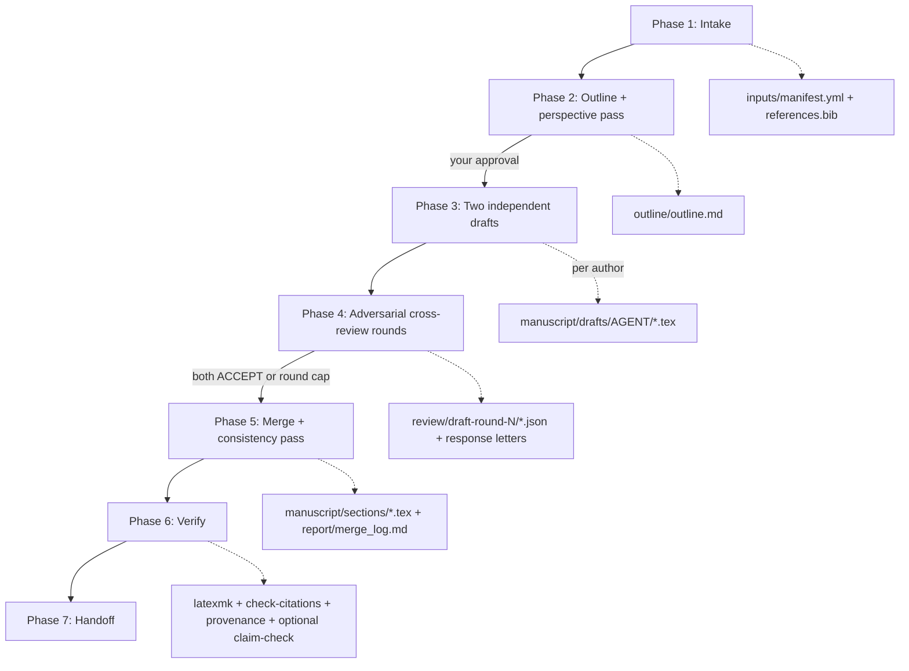

# Paper Draft Workflow

**Protocol file:** `src/scieflow/research/skills/paper-draft/SKILL.md` (the coordinator reads this).

A seven-phase pipeline that turns your [data package](../data-packages.md)
into a compilable LaTeX article draft. **Two agents from different model
families each write a complete, independent draft**, then review each
other adversarially until both accept or the round cap is hit, and the
coordinator merges the stronger version of every section. Your processing
description becomes the Methods "Data processing" subsection; every number
in Results carries a `% source: [data:<id>]` provenance comment; and the
draft is verified before landing exactly where the
[paper review](paper-review.md) loop picks it up.

## Phase overview



| Phase | Who | Output |
| --- | --- | --- |
| 1. Intake | Coordinator (+ you) | `inputs/` data package, `manuscript/references.bib` |
| 2. Outline | `research.outline` + perspective pass | `outline/outline.md` — **shown to you for approval** |
| 3. Draft | Both `research.draft-authors`, independently | `manuscript/drafts/<agent>/{abstract,introduction,methods,results,discussion}.tex` |
| 4. Cross-review | Each author reviews the other | `review/draft-round-<N>/<reviewer>-on-<author>.json` + `response-<author>.md` |
| 5. Merge | Coordinator, then `research.consistency` | `manuscript/sections/*.tex`, `manuscript/main.tex`, `report/merge_log.md` |
| 6. Verify | Coordinator | compile, citation, provenance (+ optional claim-check) results |
| 7. Handoff | Coordinator | PDF/tex locations, merge log, open review points, next steps |

## Who writes the drafts

`research.draft-authors` names the two authors. The default pair is
**`codex-paper` + `claude-paper`**: two model families, so their
disagreements in cross-review are informative rather than an echo. Change
the pair — provider, model, effort — for all projects or for one run:

```bash
uv run scieflow agent configure --workspace <slug> \
  --assign research.draft-authors=codex-paper,claude-paper --yes
```

A support-tier agent (`agy`) can draft only through the explicit per-role
exception `--promote research.draft-authors`, and only because you asked
for it. With a single author the cross-review is skipped and the handoff
says "single-author, not cross-reviewed".

## Phase 1 — Intake

A data package is **required** — this workflow drafts from your data, not
from thin air. References come either from a gap-discovery run
(`gaps_from:` in `config.yml` imports its hypotheses, gap report, and DOI
list) or from a fresh search fan-out; either way the DOIs are exported via
Zotero into `manuscript/references.bib`. Setting `journal:` reuses the
paper-review journal-profile cache so the draft targets the journal's
format from the start.

## Phase 2 — Outline

`research.outline` outlines every section as claims-with-evidence (each
bullet ends with `[data:<id>]` or a DOI); the `research.debate` agents run a
one-round [perspective pass](../debate.md) over it. Then — unless you set
`auto_approve_outline: true` — the coordinator **shows you the outline and
waits**. Drafting is the expensive phase; the approval gate is where you
redirect it cheaply.

## Phase 3 — Two independent drafts

Each author writes **all five sections** on its own; drafts are never shared
during this phase. Hard rules in every prompt: numbers only from manifest
artifacts, each with a `% source: [data:<id>]` comment; Methods must contain
`\subsection{Data processing}` written from your `processing.md`; `\cite`
keys only from the actual bib keys. A missing or empty section gets one
re-dispatch, then the author is marked failed.

## Phase 4 — Adversarial cross-review

Each author reviews the other's draft with the adversarial reviewer persona
(`templates/adversarial-review.md`) and writes a `manuscript-review` JSON:
`ACCEPT`, `MINOR REVISION` or `MAJOR REVISION`, numbered major (`M1…`) and
minor (`m1…`) points. Each author then revises **its own** draft and answers
every point — a change or a rebuttal — in a response letter. The coordinator
checks mechanically that every point id is answered and that the claimed
edits really happened. Rounds repeat until both accept or
`max_review_rounds` is reached; open points are carried into the handoff.

## Phase 5 — Merge

The coordinator picks the stronger revised version of each section (judged
on `% source:` density and correctness, unresolved review points, clarity,
outline fidelity), may splice paragraphs, and **copies numbers and
`% source:` comments exactly** — never blended. Every choice is recorded in
`report/merge_log.md`. It then fills `templates/paper/main.tex` (it will ask
rather than invent an author list), and `research.consistency` removes
cross-section contradictions without touching any number.

## Phase 6 — Verify

1. **Compile**: `latexmk -pdf` with one repair round on failure; skipped
   with a warning if LaTeX isn't installed (`setup/doctor.sh` checks).
2. **Citations**: `scieflow research check-citations` — every `\cite`-family
   command resolves, no orphan bib entries, every bib DOI traces to the
   searched/imported DOI list.
3. **Provenance spot-check**: numeric claims from Results are checked against
   the artifact they cite.
4. **Cited-source check** (optional, opt-in, advisory): claims and their DOIs
   go to the claim-check module (`skills/claim-check/SKILL.md`) when
   you have allowed it for this run.

## Phase 7 — Handoff

You get the PDF and sources, `report/merge_log.md`, the review rounds used
and final recommendations, the evidence behind each section, the verify
results and any unresolved points. The manuscript sits in
`workspace/<slug>/manuscript/` — exactly where the
[paper review](paper-review.md) loop expects it.

## How to run it properly

- **Run [gap-discovery](gap-discovery.md) first** (or at least a
  lit-review): `gaps_from:` gives the draft its framing *and* its reference
  list for free.
- **Set `journal:`** if you have a target — outline and sections follow the
  journal profile from day one.
- **Put real title/authors in `config.yml`** — the coordinator refuses to
  invent an author list.
- **Follow with paper-review in the same workspace** — it's a one-sentence
  ask once the draft lands.
- **The draft is a grounded starting point, not a submission.** Verify every
  claim yourself; you are the author of record.

## Example

```yaml
# workspace/2026-07-my-study-draft/config.yml
gaps_from: workspace/2026-07-my-study      # the gap-discovery run
journal: PLOS Computational Biology
title: "What the data actually says about X"
authors: "T. Krajca"
```

> "Draft the article for hypothesis H1 from my gap-discovery run, config
> above, same data package."

You'll be shown the outline first; after your approval both authors draft,
review each other, and the merged manuscript lands at:

```text
workspace/2026-07-my-study-draft/manuscript/main.pdf        ← compiled draft
workspace/2026-07-my-study-draft/manuscript/main.tex
workspace/2026-07-my-study-draft/manuscript/sections/*.tex  ← merged sections
workspace/2026-07-my-study-draft/manuscript/drafts/         ← both original drafts
workspace/2026-07-my-study-draft/report/merge_log.md        ← why each section won
```

Each Results line carries `% source: [data:<id>]`; the Methods section's
"Data processing" subsection is generated from your `processing.md`.
Next: "run a paper review on this draft targeting PLOS CompBio".
