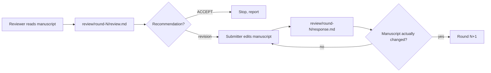

# Paper Review Workflow

**Protocol file:** `src/scieflow/research/skills/paper-review/SKILL.md`.

An iterative reviewer/submitter loop over your manuscript, optionally
impersonating a specific target journal's review standards.

## Roles

- **Submitter** — edits the manuscript in place.
- **Reviewer** — critiques it like a journal referee.

Assigned in the workspace `config.yml`. By default the reviewer is an enabled
agent that is **not** the coordinator, and the submitter is the coordinator —
so the reviewer never grades its own edits. Reviewer and submitter must always
differ.

## Setup

The manuscript (markdown or LaTeX) lives in `workspace/<slug>/manuscript/`. If
your files are elsewhere, the coordinator copies them there and tells you where
the working copy is. Relevant `config.yml` keys:

```yaml
reviewer: codex               # default: an enabled agent that isn't the coordinator
submitter: claude             # default: the coordinator
max_review_rounds: 3          # default from config/agents.yml
scope: full                   # or: sections: [Introduction, Methods]
journal: "Nature Methods"     # optional target journal
```

## Journal-specific reviewing (optional)

When `journal:` is set, a **profiling phase** runs first:

1. The journal name is slugified (`Nature Methods` → `nature-methods`).
2. If `config/journals/<slug>.md` exists, it's reused. Otherwise an agent with
   web access researches the journal's official author guidelines and writes a
   profile with a fixed structure: scope, article types & length limits,
   formatting requirements, review criteria, common rejection reasons, and a
   submission checklist — with guideline URLs cited.
3. The profile is copied to `workspace/<slug>/journal/profile.md` for the run.

The reviewer then adopts that journal's persona: scope fit, formatting
compliance, and that journal's specific review standards rather than generic
quality criteria.

!!! tip "Profile-only mode"
    If you just ask *"how does journal X accept papers?"*, only this phase
    runs — you get the profile document without any review loop.

## Review loop

For each round `N` (1 to `max_review_rounds`):



1. **Reviewer** writes `review/round-N/review.md`: summary, a
   `## Recommendation` line (`ACCEPT` | `MINOR REVISION` | `MAJOR REVISION`),
   numbered major comments (M1, M2…), numbered minor comments (m1, m2…), and
   per-section notes. From round 2 on, it also verifies the previous round's
   promised changes were actually made.
2. The coordinator parses the recommendation. `ACCEPT` → stop.
3. **Submitter** edits the manuscript files directly (minimal diffs) and writes
   `review/round-N/response.md` — a point-by-point letter quoting each comment
   and stating what changed or pushing back with justification.
4. The coordinator **verifies the manuscript actually changed** (git diff or
   mtimes). If the response claims edits but nothing changed, the submitter is
   re-dispatched once with that discrepancy stated.
5. Loop ends on `ACCEPT` or after `max_review_rounds`.

## Output

```text
workspace/<slug>/
├── manuscript/               # your paper, edited in place across rounds
├── journal/profile.md        # only if a journal was targeted
├── prompts/ · logs/          # audit trail
└── review/
    ├── round-1/{review.md, response.md}
    ├── round-2/{review.md, response.md}
    └── ...
```

The coordinator's final report: the final recommendation, rounds used, what
changed each round (from the response letters), and any remaining open
comments.
